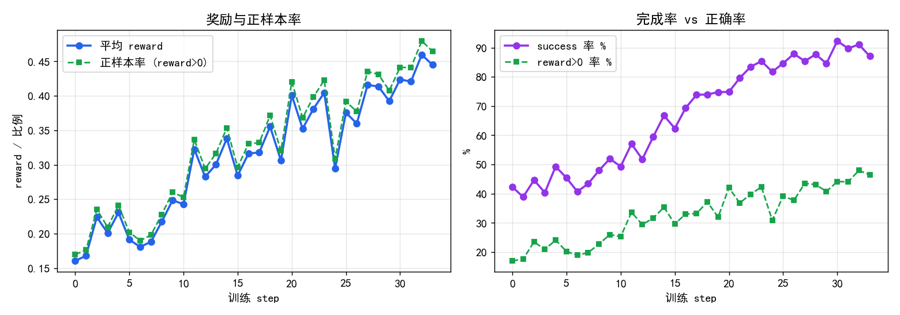
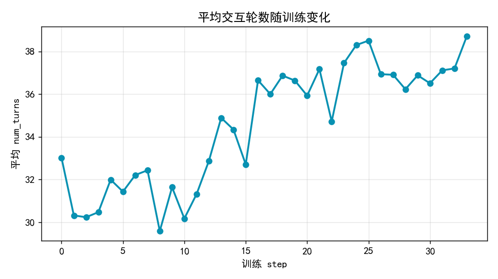
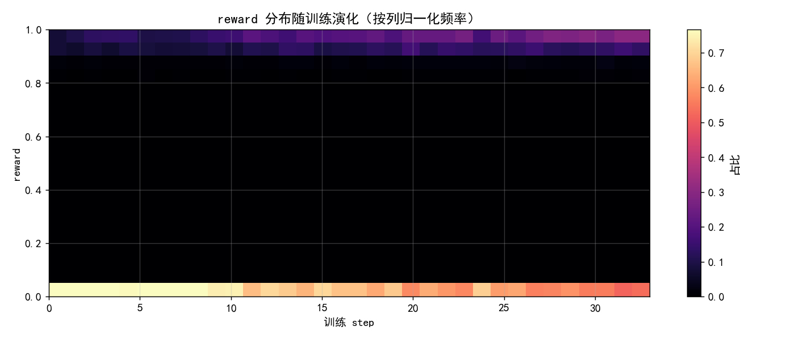
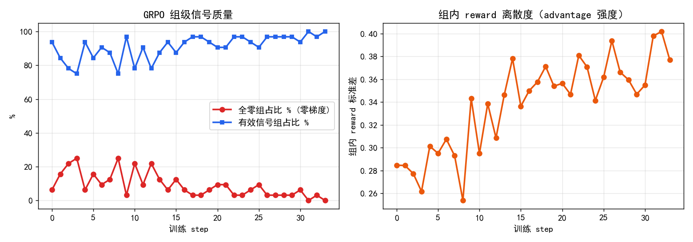
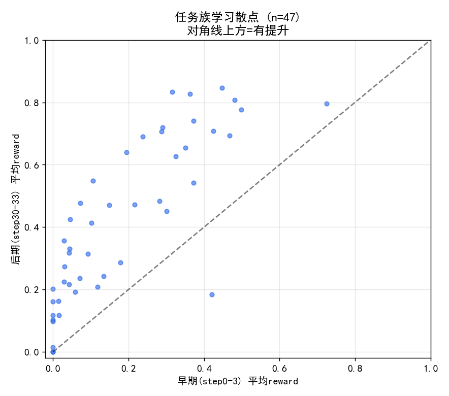
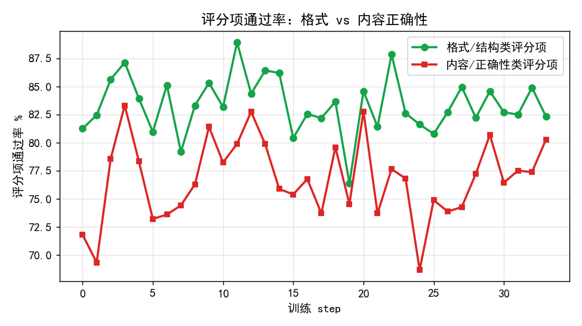

# GRPO/GSPO 训练 Rollout 分析报告

**数据集**：`0611-gspo-step-25-game_states`
**模型/算法**：Agentic 工具调用模型，GSPO（GRPO 同族，序列级重要性比）在线策略训练
**分析日期**：2026-06-15
**作者**：训练数据分析（基于 rollout 快照）

---

## 摘要（TL;DR）

- 本次训练是一段**健康且有效**的 RL 过程：34 个 step 内，平均奖励从 **0.161 单调上升到 0.445（约 +176%）**，任务完成率（success）从 **42.3% 提升到 87.1%**，全程无崩溃、无奖励坍缩。
- 奖励是一种**强连乘门控（conjunctive gating）**结构：一条轨迹必须让评测 rubric 的**每一个子项都通过**才能拿到正奖励，否则归零。因此奖励分布高度**双峰**（要么 0，要么 0.85–1.0），中间几乎为空；即便 rubric 拿到 94/100，只要有 1 个子项不过，奖励仍为 0。
- 模型学到的主要是**内容正确性**而非格式：格式/结构类评分项通过率全程稳定在 ~81–82%，而内容/数值正确性类评分项通过率从 **71.8% 提升到 80.3%**，是奖励增长的主要来源。
- **代码 agent 行为显著成熟**（详见 §6.4，全量解析 messages）：代码调用报错率 27.8%→20.4%，**能力型错误被消灭**（SyntaxError 绝对量 −61%、NameError −25%），残余错误转向"探索未知 schema"的 KeyError；最关键的是**"出错后仍完成任务"的 episode 占比从 17.7% 翻到 45.7%（≈2.6×）**——学会了 `tools["…"]` 调用约定、报错后先探查结构（26.7%→36.5%）、真实字段名 + 防御式取值、if/else 判空、try/except 自检。
- GRPO 的**组级梯度信号质量随训练改善**：早期最多约 25% 的组全员零奖励（零 advantage、零梯度），到后期降至 0；组内奖励标准差从 0.285 升到 0.377，有效信号占比从 93.8% 升到 100%。
- 存在**少数被单一苛刻子项卡死的任务族**（如 `sla_aware_bug_scoring`、`perishable_inventory_optimization` 全程奖励≈0），是后续课程设计/奖励重构的重点对象。

---

## 1. 概览与数据说明

### 1.1 数据规模与结构

| 维度 | 取值 |
|---|---|
| 快照数（step） | 34（`actor0_step0.json` … `actor0_step33.json`）|
| 每 step 的 rollout 数 | 2048 |
| 总 rollout 数 | 69,632 |
| 单条记录字段 | `task_name`、`task_uid`、`reward`、`success`、`num_turns`、`messages` |
| GRPO 组结构 | **每 step = 32 个 prompt × 64 个 rollout/prompt** → `group_size = 64` |
| 任务族（task family）数 | 215 |
| 去重后 prompt（task_uid）数 | 832 |

> **命名说明**：目录名为 `step-25`，但实际包含 step0–step33 共 34 个连续快照，覆盖了 step25 前后的完整训练片段。下文一律以文件内的真实 step 索引（0–33）为准。

### 1.2 关键采样设计：流式 prompt，而非固定集重复

每个 step 抽取 32 个 prompt，但跨 step 看，**832 个不同 prompt 中有 576 个只出现 1 次、256 个出现 2 次**（576×1 + 256×2 = 1088 = 32×34）。

这意味着训练是在一个大 prompt 池上**流式滚动采样**，而不是反复在同 32 个 prompt 上刷分。由此得出两条解读原则：

1. **奖励上升反映的是泛化能力提升**，而非对固定题目的记忆/过拟合——这是积极信号。
2. 相邻 step 的曲线存在**采样噪声**（每步题目不同、难度分布有抖动），因此曲线呈锯齿状属正常，应看趋势而非单点。

### 1.3 `reward` 与 `success` 的定义（务必先厘清）

两者是**不同的信号**，混用会严重误读：

- `success`：该轨迹是否**产出了可被评测的有效提交**（正常调用 `claim_done` 并进入评测流程）。`success=False` 的轨迹（异常中断、未提交、超轮等）**奖励恒为 0**。
- `reward`：在提交有效的前提下，对**任务正确性**的打分，取值 0 或 0.85–1.0。

二者关系（全量统计）：

| 关系 | 数值 |
|---|---|
| `success=False` ⟹ `reward=0` | 100% 成立 |
| `reward>0` ⟹ `success=True` | 100% 成立 |
| `success=True` 中 `reward=0` 的比例 | **51.3%**（提交了但答错）|

换言之：`success` 是"能不能跑完并交卷"，`reward` 是"交的卷对不对"。**当前训练前期一半以上的有效提交仍然得 0 分**，正确性才是真正的瓶颈。

---

## 2. 整体训练动态



**结论：稳定单调上升，无崩溃。**

| 指标 | step0 | step15 | step33 | 变化 |
|---|---|---|---|---|
| 平均 reward | 0.161 | 0.284 | 0.445 | **+176%** |
| 正样本率（reward>0） | 17.0% | 29.6% | 46.5% | **+29.5pp** |
| success 率 | 42.3% | 62.4% | 87.1% | **+44.8pp** |
| 有效提交内的平均分（reward∣success） | 0.379 | — | 0.511 | +0.13 |

要点：

1. **success 率（紫线）的增长比 reward 更快更平滑**——模型首先学会的是"稳定交卷"（流程/格式/不中断），即把 `success` 从 42% 拉到 87%。
2. **reward 增长滞后于 success**，且 `reward∣success`（交卷者中的平均分）也在涨（0.379→0.511），说明后期不仅交卷更稳，交对的比例也在提升——两条腿都在进步。
3. step24 出现一次明显回落（reward 0.40→0.29），但随即恢复并继续走高，属采样噪声/单 step 难题扎堆，非趋势性退化。



平均交互轮数从 **33.0 升到 38.7**：模型学会用**更多的工具调用步骤**去真正完成多步分析，而不是草草交卷。轮数上限约 97–100，**仅 0.13% 的轨迹触顶，且触顶必得 0 分**——轮数预算不是主要的奖励瓶颈，可暂不调整。

---

## 3. Reward 结构剖析（核心机制）

### 3.1 奖励是"连乘门控"：每个子项都过才给分

每条轨迹结束时，评测器返回一个 `eval_criteria`，包含若干**子评分项**（如 `correct_columns`、`severity_accuracy`、`csv_format`…），每项有 `passed` 与 `score/max_score`。

实测的奖励规则（在 step20 的 2048 条上验证）：

- **`reward>0` 的轨迹中，98.0% 的子项全部 `passed=true`，且 rubric 总分=满分（total=max）。**
- **`reward=0` 且 `success=true` 的轨迹中，91.5% 至少有一个子项 `passed=false`。**

一个典型反例最能说明问题：某轨迹 rubric 拿到 **94/100**，仅 `signal_ids`(19/20) 与 `ranking_order`(10/15) 两项未过门槛 → **最终 reward = 0**。

> **机制结论**：奖励 ≈ `全部子项通过 ? (满分折算到 0.85–1.0) : 0`。这是一个对所有子项取**逻辑与（AND）**的连乘门控；正奖励区间内还叠加了一个轻微的折扣因子（正奖励均值约 0.95 而非 1.0，推测与效率/长度相关）。

### 3.2 由此导致的奖励分布：强双峰



- 奖励要么是 **0**（约 67% 的全量 rollout），要么落在 **0.85–1.0** 的窄带；0.05–0.8 区间几乎为空。
- 随训练推进，热力图上 0 附近的质量逐渐向顶部 0.9+ 带迁移——这是学习发生的可视化证据。

### 3.3 这种奖励设计的两面性

**优点**：标准严苛、信号干净，逼模型把每一步都做对，不给"蒙混过关的部分分"。

**风险（需重点关注）**：
- **奖励极度稀疏**：单个难子项就能把一条几乎完美的轨迹清零，弱化了学习信号、抬高了方差。
- **单点瓶颈效应**：若某任务族存在一个近乎不可能通过的子项（见 §5），整族奖励会被永久锁死在 0，模型从该族**得不到任何正梯度**。

---

## 4. GRPO/GSPO 训练健康度诊断（核心）

GRPO 同族算法在**每个 prompt 的组内**用相对奖励计算 advantage。**若一组 64 个 rollout 的奖励完全相同（典型为全员 0），组内 advantage 全为 0 → 该组贡献零梯度 → 算力被浪费**。因此"组级奖励方差"是该类算法最关键的健康指标。



| 指标 | 含义 | step0 | step33 | 趋势 |
|---|---|---|---|---|
| 全零组占比 | 整组 64 个全 0、零梯度 | 6.2%（早期峰值 ~25%）| 0.0% | ✅ 显著改善 |
| 有效信号组占比 | 组内方差>0、可产生 advantage | 93.8% | 100% | ✅ |
| 组内 reward 标准差 | advantage 强度 | 0.285 | 0.377 | ✅ 上升 |

要点：

1. **训练早期（step1–8）浪费较多**：曾有 21–25% 的组全员零奖励（题目太难，64 次尝试无一得分），这部分 batch 对梯度毫无贡献。
2. **随能力提升，浪费迅速消失**：到训练后段，几乎每一组都有得分/不得分的混合，**信号密度接近 100%**。
3. **组内方差上升**意味着 advantage 的可区分度增强——这通常对应更稳定有效的策略更新，与 §2 的奖励上升相互印证。
4. **从不出现"全员满分"组**（all-solved 占比恒为 0）：即使后期，单个 prompt 的 64 次采样里也总有失败样本。正样本仍是稀缺资源，但占比在持续变大。

> **诊断结论**：本次 GRPO/GSPO 训练的组级信号质量良好且持续改善，没有出现"奖励饱和导致 advantage 消失"或"全程零梯度浪费"的病态。早期的全零组浪费是唯一可优化点（见 §7 建议的难度过滤/课程化）。

---

## 5. 任务级表现

每族包含约 384–512 条 rollout。对在**早期窗口（step0–3）**与**后期窗口（step30–33）**均有样本的 47 个任务族，对比其平均奖励：



> 散点在对角线上方=有提升。绝大多数任务族位于对角线上方，整体能力普遍上升。

### 5.1 提升最显著的任务族

| 任务族 | 早期 | 后期 | Δ |
|---|---|---|---|
| fraudulent_trading_detection | 0.32 | 0.83 | **+0.52** |
| profit_commission_validation | 0.36 | 0.83 | +0.46 |
| deicing_invoice_reconciliation | 0.24 | 0.69 | +0.45 |
| missed_pickup_compensation | 0.20 | 0.64 | +0.44 |
| signal_fault_detection_dispatch | 0.11 | 0.55 | +0.44 |
| unauthorized_supplier_audit | 0.29 | 0.72 | +0.43 |
| spoilage_root_cause_analysis | 0.45 | 0.85 | +0.40 |

### 5.2 停滞 / 退化的任务族（重点关注）

| 任务族 | 早期 | 后期 | 状态 |
|---|---|---|---|
| **sla_aware_bug_scoring** | 0.00 | 0.00 | 🔴 全程零奖励 |
| **perishable_inventory_optimization** | 0.00 | 0.00 | 🔴 全程零奖励 |
| **component_shortage_prevention** | 0.00 | 0.01 | 🔴 几乎零奖励 |
| dynamic_substitution_engine | 0.00 | 0.10 | 🟠 极低 |
| sponsorship_fulfillment_audit | 0.12 | 0.21 | 🟠 偏低 |
| volunteer_recognition_eligibility | 0.42 | 0.18 | 🟠 **退化**（唯一明显下滑）|

- 三个"全程零奖励"任务族高度可疑：结合 §3 的连乘门控，**极可能是各自存在一个永远无法通过的子评分项**（评测过严或题目不可解），导致 64 次采样全 0、组级零梯度、模型永远拿不到学习信号。
- `volunteer_recognition_eligibility` 的退化值得单独排查：可能是该族与主流任务的最优策略冲突（负迁移），或后期样本恰好更难。

### 5.3 最难通过的评分子项（全量统计，n>500）

| 评分子项 | 失败率 | 样本数 |
|---|---|---|
| risk_summary_json | **85.7%** | 600 |
| violation_count | 74.3% | 692 |
| correct_ranking | 64.8% | 565 |
| violation_identification | 54.8% | 524 |
| ranking | 50.1% | 557 |
| severity_classification | 48.7% | 797 |
| summary_statistics | 45.1% | 1942 |

这些高失败率子项集中在**结构化 JSON 汇总、精确计数、排序/分级**等"差一点就全错"的判定上，是连乘门控下最常见的"清零元凶"。

---

## 6. 行为与轨迹质性分析

### 6.1 模型学会了什么（行为层面）

- **更稳的交卷流程**：success 率 +44.8pp 主要来自学会正确收尾（调用 `claim_done`、产出符合格式的文件/CSV/JSON）。格式类评分项通过率全程 ~81–82%，说明格式从一开始就基本掌握，后期稳定保持。
- **更深入的多步执行**：平均工具调用轮数 33→39，模型用更多 turn 去读配置、过滤数据、分窗计算，而非提前收手。
- **代码/工具使用更熟练、更会纠错**：PTC 与 Python 报错率分别 27.6%→20.4%、31.2%→22.6%，"出错后仍完成任务"的 episode 占比 17.7%→45.7%。具体行为与轨迹实例见 **§6.4**。

### 6.2 失败模式分类



| 失败类型 | 表现 | 趋势 |
|---|---|---|
| **A. 无效提交（success=False）** | 未交卷/中断/超轮，奖励直接 0 | 占比从 57.7% 降到 12.9%，已基本解决 |
| **B. 内容/数值错误（success=True, reward=0）** | 交卷但子项未过门槛——算错指标、计数偏差、排序/分级错 | 内容类通过率 71.8%→80.3%，**仍是当前主瓶颈** |
| **C. 格式/结构错误** | 文件缺失、列名错、CSV/JSON 结构错 | 全程稳定 ~81–82%，非主要矛盾 |

**关键对照**：格式类通过率几乎不动（81.2%→82.3%），内容类通过率明显上升（71.8%→80.3%）。这条曲线分叉清楚地表明：**本次 RL 的增量价值主要体现在"算对/判对"的内容正确性上，而非格式规范。**

### 6.3 典型零奖励轨迹（示例）

某 `signal_fault_detection_dispatch` 轨迹（21 turn，success=True）：rubric 总分 94/100，`csv_format`/`urgency_scores`/`primary_issue`/`recommended_action`/`response_summary` 全过，唯独 `signal_ids`(19/20，漏 1 个 id) 与 `ranking_order`(10/15，排序有误) 未达门槛 → **最终 reward = 0**。

这正是 §3 连乘门控的真实写照：**一个排序错误 + 一个 id 遗漏，足以让一条 94 分的轨迹颗粒无收。**

### 6.4 代码与工具使用行为的演化（带轨迹实例）

前面几节看的是"结果"（reward/success）。这一节直接解析 `messages` 里模型写的 `programmatic_tool_call`(PTC) / `execute_python` 代码与其返回，看模型在 RL 中**作为一个"会写代码的 agent"具体学会了什么**。下表为全量解析 34 个 step、约 7000 万条消息的统计（每 step 2048 episode，口径见附录）：

| 指标 | step0 | step33 | 趋势 |
|---|---|---|---|
| 代码调用数 / step（PTC + execute_python） | 48,507 | 61,168 | **+26%**，越来越多用编程式工具调用 |
| **PTC 占代码调用比例** | 94.6% | **97.1%** | 收敛到更强的接口；execute_python 绝对量 −33%（2637→1754）|
| **代码调用报错率（每次调用）** | 27.8% | **20.4%** | 整体写得更对 |
| **出错后仍完成任务的 episode 占比** | **17.7%** | **45.7%** | **≈2.6×**：学会从错误中恢复，而非被一个 traceback 带崩 |
| 报错后下一步做"结构探查"(type/keys/isinstance) 占比 | 26.7% | 36.5% | 错误处理策略从"瞎试"转向"先探明结构再用" |
| 出错时的平均连续报错次数（错连击长度） | 1.52 | 1.39 | 即便出错，也用更少的盲目重试就纠回 |
| 至少用过一种防御式写法（try/`.get`/isinstance）的 episode 占比 | ~88% | **~97%** | 防御式编码几乎成为后期标配 |

> 注：约 **95%**（~1950/2048）的 episode 在过程中至少触发过一次代码报错——这是 agentic 任务的常态。RL 真正改变的不是"会不会出错"，而是**出错之后会不会处理、能不能纠回正确轨道**。"出错后仍完成率 17.7%→45.7%"是本节最关键的行为指标。

#### 6.4.1 错误构成的演化：能力型错误被消灭，残余错误转向"数据探索"

把每次代码报错按异常类型归类后，可以看到一个清晰的结构性迁移（按每次调用的报错率计，分母为当 step 全部代码调用）：

| 异常类型 | step0 每调用报错率 | step33 | 绝对量 step0→33 | 解读 |
|---|---|---|---|---|
| **SyntaxError** | 5.5% | **1.7%** | 2,658 → **1,026（−61%）** | **能力型**：会写合法 Python 了，最大降幅 |
| **NameError** | 4.8% | **2.8%** | 2,313 → 1,725（−25%）| **能力型**：少引用未定义变量/裸工具名（见例(1)）|
| TypeError | 4.4% | 3.1% | 2,126 → 1,926 | 能力型，稳步下降 |
| **KeyError** | 7.0% | 6.6% | 3,396 → 4,051 | **数据型**：每调用率基本持平，绝对量随调用量微增 |

按"占全部报错的比例"看更直观：**SyntaxError 从 19.7% 压到 8.2%**，而 **KeyError 从 25.2% 升到 32.4%**——不是 KeyError 变多了，而是**语法/命名这类"不会写代码"的错误被基本清除后，残余错误越来越集中在 KeyError 这种"面对未知任务库 schema 时取错字段"上**。换句话说，模型的瓶颈从"编程能力"转移到了"对陌生数据结构的探索与适配"，这与下面例(2)(3) 的恢复行为、以及 §5.3"结构化数值子项最难过"的结论互相印证。

#### 6.4.2 五个行为，各自的普遍程度 + 真实轨迹实例

下面每个行为都给出在全量数据里的**比例/趋势**，再配一段后期（step33）真实轨迹片段（均已截断、保留要点）。

**(1) 学会工具调用约定：PTC 里 env 工具只能用 `tools["名字"]` 调，不能当裸函数调** ——*普遍程度：NameError 每调用率 4.8%→2.8%，绝对量 2,313→1,725（−25%）。*

`textbook_demand_analysis/v2`，模型先写：

```python
departments = list_departments()        # ← 当成全局函数直接调
```
返回 `NameError: name 'list_departments' is not defined`。这是 PTC 沙盒最常见的坑（env 工具注入在 `tools` 字典里）。后期模型基本不再犯——稳定地写成 `tools["list_departments"]()`，是 NameError 下降的主因。

**(2) 学会"先探明 schema 再用"——典型的错误恢复模式** ——*普遍程度：报错后下一步做结构探查的占比 26.7%→36.5%。*

`aggregate_limit_monitoring/v2`（最终 reward=0.89）。模型先假设返回是个 list：

```python
advices = tools["get_loss_advices"](treaty_id="TR-0001")
print(advices[0])          # → KeyError: 0  （其实返回的是 dict）
```
下一步立刻改为**结构探查**而不是重试：

```python
advices = tools["get_loss_advices"](treaty_id="TR-0001")
print(f"Type: {type(advices)}")
print(f"Keys: {list(advices.keys()) if isinstance(advices, dict) else 'N/A'}")
print(f"Full: {advices}")
```
探明结构后再正确取值。这正是 §6.4.1 里 KeyError 成为残余主错、却没拖垮完成率的原因——模型学会了把 KeyError 当成"探查信号"而非"失败"。

**(3) 学会用真实字段名 + 防御式取值（错→对的纠正对）** ——*普遍程度：KeyError 仍是占比最高的残余错误（32.4%），但"出错后仍完成"翻到 45.7%，说明大多被这种纠正对化解。*

`deployment_readiness_gate/v1`（最终 reward≈0.97）。先猜字段名：

```python
print(f"{details['service_name']} | crit={details.get('critical','?')}")   # → KeyError
```
纠正为既用**真实字段名**又**带默认值兜底**：

```python
crit = details.get('criticality', '?')      # 真实字段是 criticality，且 .get 兜底
print(f"name={details['name']} | criticality={crit}")
```
注：盲用 `.get(默认值)` 的代码占比反而**略降**（37.5%→31.7%）——后期模型更倾向于"先探明真实字段名再精确取"，而不是一味用默认值兜底掩盖结构错误。

**(4) 学会用 if/elif/else 处理"空结果 / 分支情况"，而不是假设数据总是齐全** ——*普遍程度：约 30% 的 PTC 调用含 if/else 分支、约 86–91% 含 for/while 循环（全程稳定），是后期高 reward 轨迹的标准形态。*

`deployment_readiness_gate/v1`（reward=0.96），一次干净无报错的 PTC：

```python
for sid in service_ids:
    scans = tools["get_security_scans"](service_id=sid).get("scans", [])
    if scans:
        print(f"SERVICE {sid}: {len(scans)} scans, types={set(s['scan_type'] for s in scans)}")
    else:
        print(f"SERVICE {sid}: NO scans")        # ← 显式处理空分支
```
这类"循环批量调工具 + 分支判空 + 聚合"的结构化代码，也是 PTC 调用量 +26%、占比升到 97% 的来源——模型用一次 PTC 顶过去好几次零散的单工具调用。

**(5) 学会用 try/except 做防御性校验** ——*普遍程度：try/except 仅占 ~2–3% 的 PTC 调用（偏低），但把 try/except、`.get`、isinstance 合起来看，后期 ~97% 的 episode 至少用过一种防御写法。*

`deployment_readiness_gate/v1`（reward=0.94），交卷前自检产物：

```python
with open('blocking_issues.json') as f:
    try:
        data = json.load(f)
        print(f"JSON load successful: {len(data)} entries")
    except json.JSONDecodeError as e:
        print(f"JSON error: {e}")            # ← 先验证自己写出的文件合法再交卷
```

**小结**：把 §6.1 的"学会收尾、执行更深"再具体化——后期模型在代码层面形成了五个可量化的稳定习惯：① 遵守 PTC 调用约定（NameError −25%）；② 报错后先探查结构（26.7%→36.5%）；③ 用真实字段名 + `.get` 精确取值；④ if/else 判空 + 批量循环聚合（~30% 含分支、~88% 含循环）；⑤ 防御式校验（~97% episode 至少用一种）。其综合效应是：**能力型错误（语法/命名）被基本消灭，残余错误转向数据探索型（KeyError），而"出错后仍完成率"翻了约 2.6 倍（17.7%→45.7%）。** **需诚实说明的局限**：(a) try/except 显式使用率仍低（~2–3%），错误恢复更多靠"探查—重写"而非结构化异常处理；(b) 首次代码调用的报错率仅从 ~25% 微降到 ~18–20% 且含采样噪声，说明提升主要来自"错后会改"而非"一次写对"；(c) 这些都是"过程行为"的改善，最终能否拿分仍受 §3 连乘门控制约（行为变好 ≠ 一定过门槛）。

#### 6.4.3 放大看"结构探查"行为：这个涌现习惯到底怎么演化的

"结构探查"（用 `type()` / `.keys()` / `isinstance` / `dir()` / `len()` / pandas 的 `.columns/.dtypes` 等先弄清返回结构再用）是本次最有意思的涌现行为，单独拆开看 step0 vs step33：

| 维度 | step0 | step33 | 走向 |
|---|---|---|---|
| 探查代码占全部代码调用 | 19.4% | 21.5% | **基本持平**（全程 17–22% 抖动）|
| 含 ≥1 次探查的 episode 占比 | 84.3% | **93.3%** | **↑ 明显**，几乎全覆盖 |
| 探查中"出错后才做"（被动）占比 | 85.0% | 83.9% | **持平**，始终以被动为主 |
| 首次探查出现的平均代码调用序号 | 4.29 | **3.42** | **↓ 更早探查** |
| `type()` 占探查代码 | 24.9% | **35.4%** | ↑ 更重类型判别（dict/list 混淆）|
| `.keys()` / `len()` 占探查代码 | 73.8% / 64.9% | 69.7% / 53.0% | 仍是主力，略降 |
| reward(探查 ep) vs reward(无探查 ep) | 0.166 **>** 0.151 | 0.434 **<** 0.601 | **符号翻转**（见下，混淆效应）|

五点解读：

1. **不是"探查更频繁"，而是"探查铺开到几乎所有 episode"**：每次调用里的探查密度没怎么涨（~20% 持平），但带探查的 episode 从 84.3%→93.3%——探查从"部分轨迹的偶发动作"变成几乎人人会用的标准动作。
2. **探查始终是"被动救火"而非"主动预防"**：全程 ~83–85% 的探查发生在该 episode 已经报错之后，且这个比例**没有变**。模型学会的是"撞墙后会摸结构"，**没有**进化出"第一次碰新工具就先探查"的主动习惯——这是清晰的改进方向。
3. **但它学会了"更早开始摸"**：首次探查从第 ~4.3 次代码调用提前到 ~3.4 次，配合 §6.4 主表"报错后下一步就探查 26.7%→36.5%"，说明模型缩短了"瞎试 → 开始探查"的延迟。
4. **探查工具箱里 `type()` 占比涨最多（24.9%→35.4%）**：对应 §6.4.1 的 dict/list 混淆类错误，模型更多用类型判别而不只是 `.keys()`。
5. **reward 符号翻转是混淆效应，非因果**：后期"无探查 episode"reward 反而更高（0.60 vs 0.43）。这**不代表探查有害**——探查绝大多数由错误触发，故"探查 episode"≈"碰到过麻烦的较难 episode"；后期模型把简单题直接一把过（无探查、高分），需要探查的本就是更脏更难的题。早期所有题 reward 都低，这个选择效应被淹没，故那时看不出来。属观察性相关，不能下因果结论。

> 复现：`report/scripts/probe.py`。探查原语集合与"主动/被动"（被动=该 episode 在此探查前已出现过报错）的定义见脚本。

---

## 7. 结论与建议

### 7.1 结论

1. **训练有效、健康，应继续**：奖励、完成率、正样本率全程单调上升，GRPO 组级信号质量持续改善，无坍缩、无饱和、无大面积零梯度浪费。
2. **当前主瓶颈是内容正确性**，而非格式或流程；流程问题（无效提交）已基本解决。
3. **奖励的连乘门控设计是一把双刃剑**：保证了高标准，但造成奖励极稀疏、单点子项可清零整条轨迹，并使少数任务族被永久锁死在 0。

### 7.2 可执行建议

| 优先级 | 建议 | 依据 |
|---|---|---|
| 🔴 高 | **排查 3 个全程零奖励任务族**（sla_aware_bug_scoring 等）的卡死子项，确认是"题难"还是"评测器 bug/过严"，修复或暂时移出训练集 | §5.2，连乘门控下零梯度，纯浪费算力 |
| 🔴 高 | **考虑给奖励引入部分信用（partial credit）或子项加权**，缓解"94 分=0 分"的极端稀疏，降低 advantage 方差 | §3.1、§6.3 |
| 🟠 中 | **早期引入难度过滤/课程学习**：对 64 次采样全 0 的 prompt 降采样或后置，减少早期 ~25% 的全零组浪费 | §4 全零组占比 |
| 🟠 中 | **针对高失败子项做定向数据/提示增强**：risk_summary_json、violation_count、ranking 等结构化数值任务 | §5.3 |
| 🟢 低 | **单独排查 volunteer_recognition_eligibility 的退化**，确认是否存在负迁移 | §5.2 |
| 🟢 低 | 轮数预算（~100）暂不需调整，触顶率仅 0.13% | §2 |

---

## 附录：方法说明

- **数据提取**：用 `jq` 流式解析 34 个 JSON（每个 300–800MB），抽取每条 rollout 的标量字段与 `eval_criteria` 子项（共 318,341 条子项记录），避免全量载入 `messages`。
- **§6.4 代码行为分析**：另用 Python 全量解析 `messages`（多进程，8 并发），正则抽取每个 assistant 轮里的 `<function=...>` 调用与其对应 tool 返回，按 `programmatic_tool_call`/`execute_python`/`terminal` 分类统计报错（traceback / `*Error` / `[stderr]` / `[Terminal Error]` 等标记）、控制流（if-else / for-while / try-except）与"报错→恢复"配对；"出错后仍完成"按 episode 粒度（命中过代码报错且最终 reward>0）统计。复现脚本（已随报告留存，在 `0611-gspo-step-25-game_states/` 目录下直接运行）：`report/scripts/mine.py`（调用量/报错率趋势）、`report/scripts/rates.py`（恢复率/探查率/`.get` 使用率）、`report/scripts/enrich.py`（§6.4.1 错误类型构成、首调错误率、错连击长度、PTC 占比、防御式 episode 占比）、`report/scripts/examples2.py`（错→对纠正对等实例摘取）。错误类型按 traceback 末行的 `XxxError:` 标记归类；"防御式 episode"=该 episode 至少有一次代码含 `try/except`、`.get(` 或 `isinstance(`。
- **统计口径**：组级方差用总体标准差（population std）；"全零组"定义为组内 max(reward)=0；"有效信号组"定义为组内 std>1e-9。
- **任务族对比**：早期=step0–3、后期=step30–33 的并集均值；仅纳入两窗口均有样本的 47 个族。
- **复现脚本**：`/tmp/analyze.py`（绘图与统计）、`/tmp/rollout_scalars.csv`、`/tmp/rollout_groups.csv`、`/tmp/eval_criteria.csv`。
- **注意事项**：因每 step 采样不同 prompt（流式），单 step 数值含采样噪声，所有趋势性结论均基于多 step 走势而非单点。
